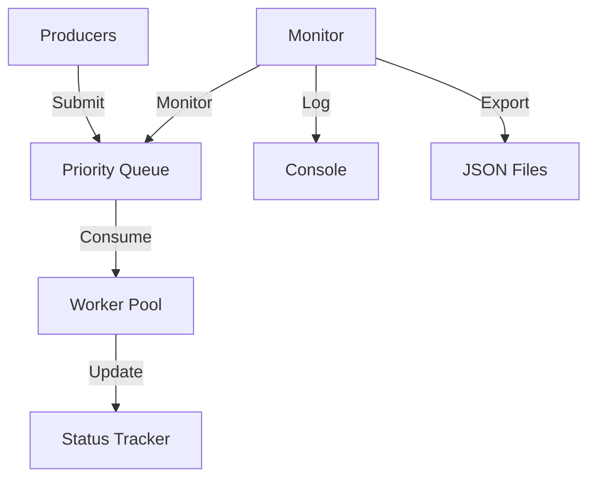

# ConcurQueue - Concurrent Job Queue System


## Table of Contents
1. [Overview](#overview)
2. [Features](#features)
3. [System Architecture](#system-architecture)
4. [Getting Started](#getting-started)
   - [Prerequisites](#prerequisites)
   - [Installation](#installation)
5. [Configuration](#configuration)
6. [Usage](#usage)
7. [Monitoring](#monitoring)
8. [Testing](#testing)
9. [Troubleshooting](#troubleshooting)
10. [Contributing](#contributing)
11. [License](#license)

## Overview

ConcurQueue is a high-performance, concurrent job queue system designed for backend processing. It provides:

- Priority-based task processing
- Dynamic worker pool scaling
- Real-time monitoring
- Fault tolerance with retry mechanism
- Graceful shutdown handling

## Features

| Feature | Description |
|---------|-------------|
| Priority Queue | Tasks processed based on priority (0-9) |
| Worker Pool | Configurable thread pool for concurrent processing |
| Task Tracking | Real-time status monitoring (SUBMITTED, PROCESSING, COMPLETED, FAILED) |
| Retry Mechanism | Automatic retry for failed tasks (up to 3 attempts) |
| Dynamic Scaling | Workers scale based on queue load |
| JSON Export | Periodic status exports for monitoring |
| Graceful Shutdown | Completes in-progress tasks before shutdown |

## System Architecture



### Components

1. **Task Producers**: Generate tasks with varying priorities
2. **Priority Queue**: Stores tasks in priority order
3. **Worker Pool**: Processes tasks from the queue
4. **Status Tracker**: Maintains task states
5. **Monitor**: Logs metrics and exports status

## Getting Started

### Prerequisites

- Java 11+
- Maven 3.6+
- 500MB+ disk space (for status exports)

### Installation

1. Clone the repository:
   ```bash
   git clone https://github.com/your-repo/concurqueue.git
   cd concurqueue
   ```

2. Build the project:
   ```bash
   mvn clean package
   ```

3. Run the system:
   ```bash
   java -cp target/concurqueue-1.0-SNAPSHOT.jar org.example.concurqueue.Main
   ```

## Configuration

Edit `Main.java` for configuration:

```java
// Core settings
private static final int PRODUCER_COUNT = 3;          // Number of producer threads
private static final int INITIAL_WORKERS = 5;         // Initial worker threads
private static final int MAX_WORKERS = 10;            // Maximum worker threads
private static final int MAX_TASKS_PER_BATCH = 5;     // Max tasks per producer batch
private static final int MONITOR_INTERVAL_SEC = 5;    // Monitoring interval
private static final String STATUS_EXPORT_PATH = "status_exports"; // Export directory
```

## Usage

### Task Lifecycle

1. **Submission**:
   ```java
   Task task = new Task("DataProcessing", 7, "payload");
   taskQueueManager.submitTask(task);
   ```

2. **Processing**:
   - Workers automatically fetch and process tasks
   - Higher priority tasks execute first

3. **Completion/Failure**:
   - Successful tasks marked COMPLETED
   - Failed tasks retried up to 3 times before marked FAILED

### Monitoring Console

Example output:
```
14:30:45 [Producer-1] INFO - Submitted Task#A1 (Priority:8)
14:30:46 [worker-3] INFO - Processing Task#A1 (420ms)
14:30:47 [Monitor] INFO - Queue:3 Workers:5/7 Active:4 
14:30:48 [Monitor] INFO - Scaling workers +2 (QueueSize:21)
```

## Monitoring

The system provides two monitoring mechanisms:

1. **Console Logs**:
   - Real-time status updates every 5 seconds
   - Shows queue size, active workers, processed/failed counts

2. **JSON Exports** (in `status_exports/`):
   ```json
   {
     "timestamp": "2023-05-01T14:36:00Z",
     "queueSize": 2,
     "processedTasks": 1423,
     "failedTasks": 17,
     "taskStatuses": {
       "task1": "COMPLETED",
       "task2": "PROCESSING"
     }
   }
   ```

## Testing

Run the test suite:
```bash
mvn test
```

Test coverage includes:
- Unit tests for all components
- Concurrency tests
- Failure scenario tests
- Integration tests

## Troubleshooting

| Issue | Solution |
|-------|----------|
| `status_exports` directory not found | Create directory manually or update `STATUS_EXPORT_PATH` |
| Workers not scaling | Verify `queueSize > 20` triggers scaling in `Main.java` |
| High memory usage | Reduce `MAX_WORKERS` or `MAX_TASKS_PER_BATCH` |
| JSON export failures | Check disk space and permissions |

## Contributing

1. Fork the repository
2. Create your feature branch (`git checkout -b feature/fooBar`)
3. Commit your changes (`git commit -am 'Add some fooBar'`)
4. Push to the branch (`git push origin feature/fooBar`)
5. Create a new Pull Request

## License

Distributed under the MIT License. See `LICENSE` for more information.
